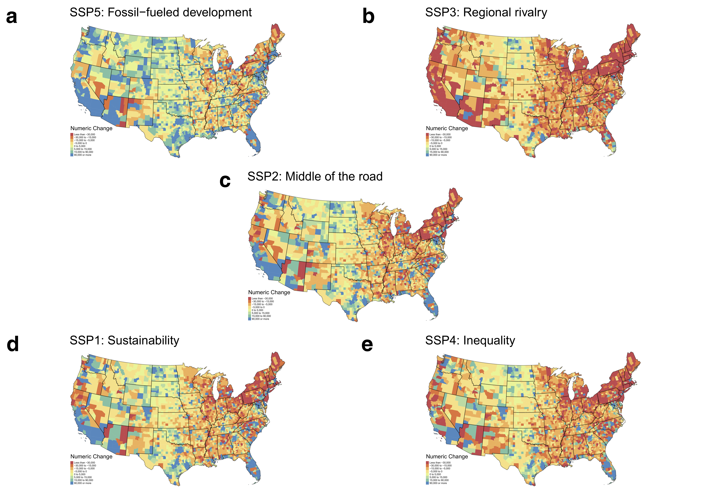

# Introduction
Here I provide the code for:  [**Population projections for all U.S. counties by age, sex, and race controlled to the Shared Socioeconomic Pathways**](link will go here)

### Citation

> Citation will go here.

# Abstract

Small area and subnational population projections are important for understanding long-term demographic changes and typically take the form of a cohort-component model. Cohort-component relies on oftentimes difficult or even impossible to obtain subnational components of change due to data suppression for privacy reasons, small-cell sizes, or are simply unavailable. Cohort-Change Ratios (CCRs) are one approach that overcomes these data limitations but tend to produce unrealistic projected populations due to exponential compounding. I present a simple, parsimonious projection technique based on a variation of CCRs I call cohort-change differences (CCDs). Using ex-post facto analysis for the period 2000-2015 for 3,136 U.S. counties in temporally rectified county boundaries, eighteen five-year age groups (0-85+), two sex groups (Male and Female), and three race-groups (White, Black, Other) using CCDs in a Bayesian structural time series for the period 1969-2000, I show that CCDs produce reduced errors compared to CCRs. I then provide countylevel population projections by age, sex, and race in five-year intervals for the period 2020-2100, using Bayesian structural time series, consistent with the Shared Socioeconomic Pathways. These data and methods have numerous potential uses and can serve as inputs for addressing questions involving sub-national demographic change in the United States.

*Projected numeric population changes for the five SSPs between 2020 and 2100 for counties in the continental United States.*

# Organization
- `SCRIPTS`  — Scripts and output for figures included in the documentation.
- `DATA`  — Initial data resources, unprocessed.
- `DATA-PROCESSED` — Processed data used to create the projections.
- `FIGURES` — output figures.
- `PROJECTIONS` — contains two subfolders. `PROJECTIONS/EVAL/` contains the out-of-sample validation for the period 2000-2015. `PROJECTIONS/PROJECTIONS/` contains the actual projections.

# Use
- Feel free to create a new branch for further incorporation and analysis . 
- More information in is located in each folder `DATA`.

# Correspondence
For any issues with anonymization or major issues with the functionality of the script please [create an issue](https://github.com/mathewhauer/county_projections_official/issues).

## License
The data collected and presented is licensed under the [Creative Commons Attribution 3.0 license](http://creativecommons.org/licenses/by/3.0/us/deed.en_US), and the underlying code used to format, analyze and display that content is licensed under the [MIT license](http://opensource.org/licenses/mit-license.php).
